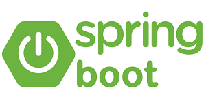
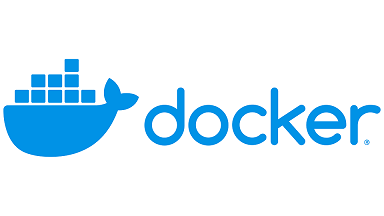
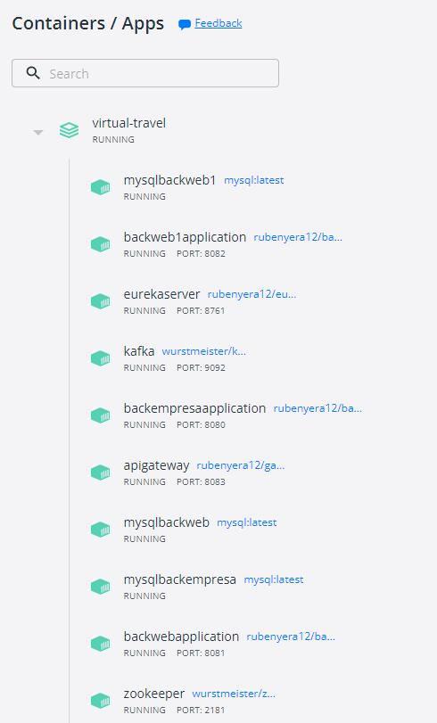
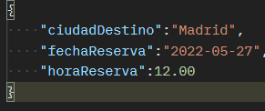
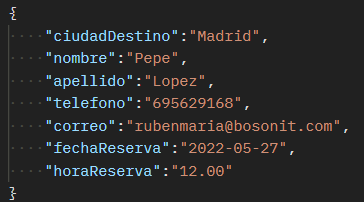
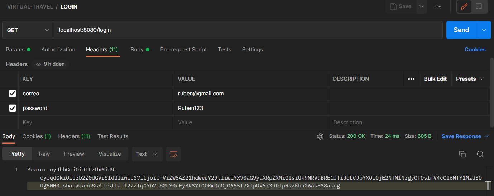

## Virtual-Travel

---

# Ejercicio Final Cloud

## Introducción
La intención de este ejercicio final será de aplicar los conocimientos adquiridos en el periodo de formación, desarrollando así el Back de una aplicación web.
La aplicación a desarrollar será el backend de una página web para la agencia de autobuses ‘VIRTUAL-TRAVEL’.

## Descripción

Esta aplicación consistirá en en la reserva de viajes de autobuses de la agencia 'VIRTUAL-TRAVEL'.
El pago se realizará en el autobús, por lo cual no habrá pasarela de pago.

Contará con dos tipos de back: BackEmpresa y BackWeb
- BackEmpresa: Será el servidor de la aplicación instalada en la empresa. Se comunicará con BackWeb pero también podrá recibir reservas externas. Será el encargado de realizar la confirmacion de la reserva mediante el envío de un correo electronico.
- Backweb: Será el servidor que recibirá las peticiones del front donde se realizan las reservas. En nuestro caso, usaremos PostMan para realizar las peticiones.

## Tecnologías usadas:
 Para la lógica de la aplicación.
 Comunicará de forma asíncrona los diferentes Backs de la aplicación.
  Que Balanceará la carga para distribuir las peticiones entre los diferentes BackWebs.
 Exportar la aplicación y gestionar todos los servicios de cara al exterior.

### Manual de usuario:
En primer lugar tendremos que bajarnos el proyecto en el siguiente enlace:[https://github.com/RubenYera12/VIRTUAL-TRAVEL], y en la carpeta raiz abriremos una linea de comandos y ejecutaremos (previamente instalado docker):

>docker compose up -d

Tras ejecutar el comando, abriremos dockerDesktop y veremos que se habrán creado los siguientes contenedor

Un total de 10, donde tendremos las 3 bases de datos en MySQL, kafka + zookeeper, eureka + apigateway y las instancias de los diferentes back, tanto webs como empresa.

Una vez levantados los diferentes contenedores podremos probar la aplicación. Para ello, he adjuntado una colección de postman con los endpoints implementados, que voy a explicar a continuación.

- (POST) localhost:8080/api/v0/Bus 
  
  Insertará en la base de datos un autobus, los datos a introducir serán:

  
- (GET) localhost:8080/api/v0/Bus/BUS0001 

   Devolverá un autobus por su ID

- (GET) localhost:8080/api/v0/Bus

  El resultado será una lista de autobuses.

- (Delete) localhost:8080/api/v0/Bus/BUS0001 
  
  Borrará de la base de datos el autobus con ese id.

- (PUT) localhost:8080/api/v0/Bus/activar?dia=2022-05-27&hora=12.00&destino=Madrid

  Si el autobus está cancelado, lo volverá a activar.

- (POST) localhost:8083/api/v0/Reserva

  Reservará un viaje en la base de datos, los datos a introducir serán:

  
  
  Habrá que tener en cuenta los datos validados.

- (GET) localhost:8083/api/v0/Reserva

  Devolverá una lista de todas las reservas.

- (GET) localhost:8083/api/v0/Reserva/RES0001

  Devolverá una reserva por su ID.

- (GET) localhost:8083/api/v0/Reserva/ByDiaHoraDestino?dia=2022-05-27&hora=12.00&destino=Madrid

  Devolverá una lista de reservas por su ciudad de destino, fecha y hora de viaje.

- (GET) localhost:8083/api/v0/Reserva/NumPlazasByDiaHoraDestino?dia=2022-05-12&hora=17.00&destino=Madrid

  Devolverá el número de plazas disponibles en un viaje determinado.

- (PUT) localhost:8080/api/v0/Reserva/cancel/Trip?dia=2022-05-27&hora=12.0&destino=Madrid

  Cancelará un viaje y todas sus reservas asociadas.

- (PUT) localhost:8081/api/v0/Reserva/cancel/RES0001

  Cancelará una reserva por su ID.

- (DELETE) localhost:8080/api/v0/Reserva/RES0001

  Borrará una reserva por su ID.

- (GET) localhost:8080/api/v0/correos/sentTo?correo=rubenmaria.yera@bosonit.com

  Devolverá todos los correos mandados a un email.

- (GET) localhost:8080/api/v0/correos/Byintervalos?fechaInferior=2022-05-27&fechaSuperior=2022-05-29

  Devolverá todos los correos mandados a las reservas de un autobus

- (GET) localhost:8080/login

  Devolverá un token

  

